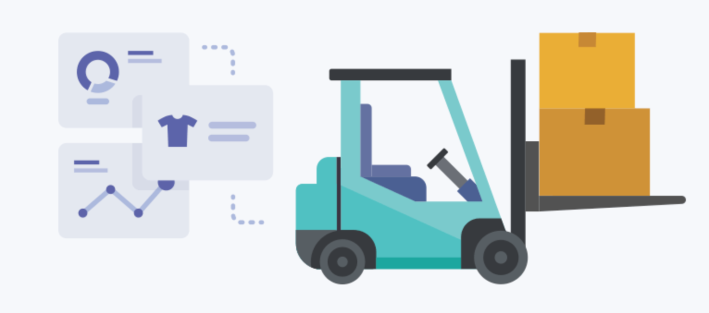
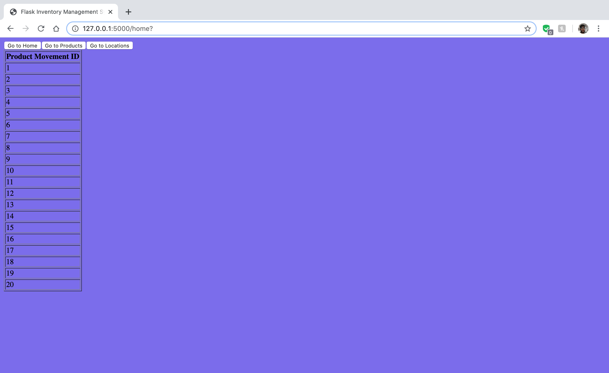
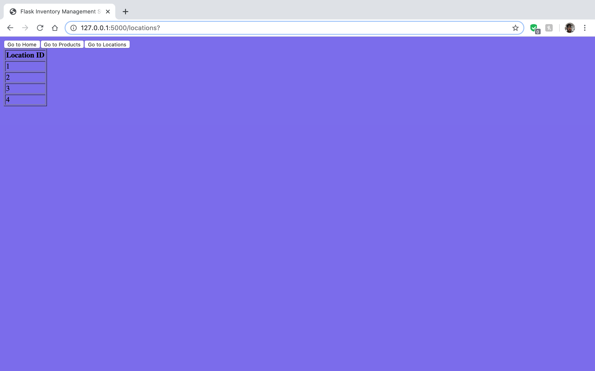

# Flask-Test

For more details, refer to this [Page](https://frappe.io/flask-test)

This repository contains the code I wrote for the Flask-test by Frappe.io. The goal is to create a web application using Flask framework to manage inventory of a list of products in respective warehouses. Imagine this application will be used in a shop or a warehouse that needs to keep track of various products and various locations. 

# Inventory Management Web Application

The goal is to create a web application using Flask framework to manage inventory of a list of products in respective warehouses. Imagine this application will be used in a shop or a warehouse that needs to keep track of various products and various locations. In order to connect our web app to the mysql database, we need a connector. Note that there are lots of Mysql connectors out there (mysqldb, pymysql)but most of them are deprecated and/or have shoddy documentation. Even after using the official mysql-connector from the site, I was getting an error because the default authorization plugin (to encrypt/decrypt passwords) is caching_sha2_password which is no longer supported. I eventually solved it by downloading my-sql-connector-python using pip. 

The application covers the following functionalities:

## Database Tables:

- Product (product_id)
- Location (location_id)
- ProductMovement (movement_id, timestamp, from_location, to_location, product_id, qty)

Note: Any one, or both of from_location and to_location can be filled. If we want to move things into a location, from_location will be blank, if we want to move things out, then to_location will be blank.

## Views:

- Add/Edit/View Product
- Add/Edit/View Location
- Add/Edit/View ProductMovement

## Report:
- Balance quantity in each location

## Use Cases:
- Create 3/4 Products
- Create 3/4 Locations
- Make 20 ProductMovements
- Get product balance in each Location in a grid view, with 3 columns: Product, Warehouse, Qty

# Application Screenshots:

I have created 4 products with product_id 1 to 4, and 4 locations with location_id 1 to 4. This is followed by 20 Product Movements with movement_id 1 to 20. For more details, refer the file mysql.txt. The home screen displays contents of the ProductMovement Table, while products and locations display contents of the Product and Location Tables in MySQL.

